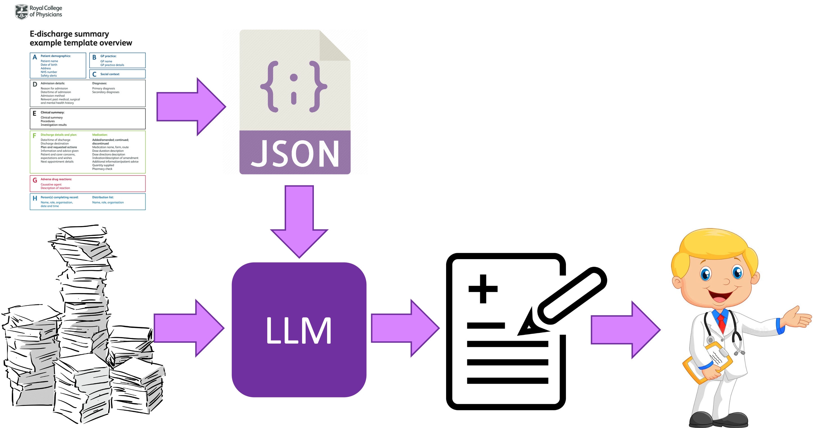

# LLM Discharge Summaries

This repo contains the experimental code for the paper "Automated Generation of Hospital Discharge Summaries Using Clinical Guidelines and Large Language Models"

In brief the method is:
1. Convert a set of [guidelines from the Royal College of Physcians London](https://www.rcplondon.ac.uk/guidelines-policy/improving-discharge-summaries-learning-resource-materials) (RCP) into a json schema
1. Convert an example also provided by RCP into a 1 shot prompt
1. De-duplicate a set of physician notes ([MIMIC-III](https://physionet.org/content/mimiciii/1.4/) used for experiments)
1. Use the above as a prompt to an LLM ([GPT-4-turbo](https://platform.openai.com/docs/models/gpt-4-and-gpt-4-turbo))

## Setup

Requirements [poetry](https://python-poetry.org/docs/) and approval to access to [MIMIC-III](https://physionet.org/content/mimiciii/1.4/)

Install required packages

`poetry install`

Download mimic-III notes

`wget -r -N -c -np --user simonellershawucl --ask-password -P ./mimic_experiments/inputs/ https://physionet.org/files/mimiciii/1.4/NOTEEVENTS.csv.gz`

`gzip -d mimic_experiments/inputs/physionet.org/files/mimiciii/1.4/NOTEEVENTS.csv.gz`

## Running

As all experiments used MIMIC-III we cannot distribute the produced summaries and evaluation (conducted by a team of clinicians).

But the notebooks (from 1-4) in `mimic_experiments/` allows for recreation of all the discharge summaries evaluated in the paper including as an excel for human annotations.

Also the code used to generate the metrics (notebook 5) is given for transparency however cannot be run without access to the clinical annotation. If this is of interest and you are a credentialed MIMIC user please reach out.

## Future Work

- Simple Streamlit demo
- Some code decisions were suboptimal but are entrenched for reproducbility (e.g. dealing with empty json values when creating annotator excels rather than when saving to json)

## Contact

Please contact <simon.ellershaw.20@ucl.ac.uk> with any questions
